<h1 align="center">Personal Slack agents</h1>

<p align="center"><b>DM your own Claude Code, Codex, and Gemini sessions from Slack, and they answer in the thread.</b></p>

<p align="center">
  
  
  
</p>

You run long-lived command-line agent sessions in tmux, each with its own working directory, login, and hours of context.
This bridge puts every session behind its own Slack bot.
You DM the bot or @-mention it in a channel.
The message lands inside the live session as if you typed it, and the session posts its answer back in the thread.
Everything runs on your own machines.

<p align="center">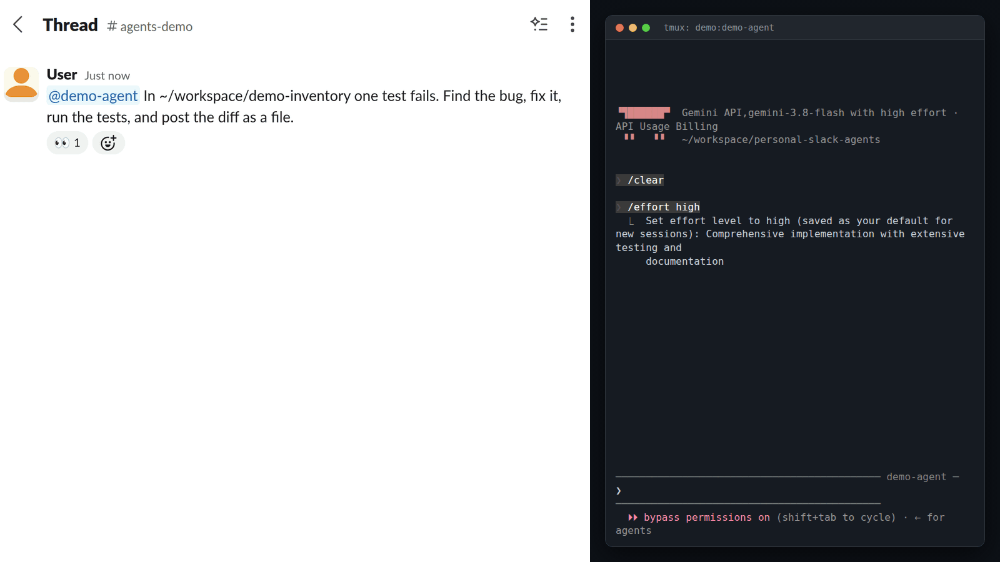</p>
<p align="center"><sub>One Slack message. The agent finds the failing test, fixes it, runs the suite, and posts <code>fix.diff</code> in the thread. Slack thread on the left, the agent's tmux pane on the right. Waits play at 3x.</sub></p>

## What you can do

| In Slack | What happens |
|---|---|
| DM or @-mention an agent | The message lands in its live session, and it answers in the thread. |
| Attach a file | The agent gets it as a local path. It can post files back. |
| `@agent !stop` | Interrupts the running task. |
| `@agent !effort high` or `!model <name>` | Changes the effort level or model of the live session. |
| `@agent !compact` or `!clear` | Compacts or clears the session context. |
| `@agent !goal <text>` or `!clear-goal` | Sets or clears a standing goal. |
| `@agent !rename <name>` or `!unregister` | Renames or removes the agent. |
| `@channel` or `@here` | Reaches every agent in the channel. |

Only the Slack users listed in `operator.txt` can use the `!` controls.

Also:

- **Any model.** Claude, OpenAI Codex/GPT, and Gemini agents all run in Claude Code, the last two through [claude-code-router](https://github.com/musistudio/claude-code-router).
- **Several accounts and computers.** Each agent can use its own subscription, and agents on different computers share one workspace.
- **Agents talk to each other.** One agent can @-mention another in a thread and use its answer.
- **Tokens stay out of the session.** Only `slack-send` reads the bot token.

The full behavior is in [`SLACK_FEATURES.md`](SLACK_FEATURES.md).

## Quick start

```bash
git clone <this repo> ~/personal-slack-agents
cd ~/personal-slack-agents
setup/setup-slack-bridge.sh          # venv, ~/.local/bin links, systemd units, bridge start
slack login                          # one-time Slack CLI login on this machine

# From inside a running Claude Code session, give it a Slack identity:
slack-register my-agent --kind claude --workdir "$PWD" --claude-config-dir ~/.claude

# Or create a new agent in a tmux session called "work":
slack-spawn my-agent --tmux-session work
```

Then DM `@my-agent` in Slack.

Paste [`docs/CLAUDE-slack.md`](docs/CLAUDE-slack.md) into your agents' `CLAUDE.md` (or `AGENTS.md` for Codex). Those rules tell an agent when to answer, how to reply with `slack-send`, and when to stay quiet.

## Demos

Each clip is a real Slack thread on the left and the agent's tmux pane on the right. Waits play at 3x.

<details>
<summary><b>Fix a bug from an attached crash log</b></summary>
<br>
<p>Attach <code>crash.log</code> to the message. The agent reads it, names the KeyError, adds a test, and commits the fix.</p>
<p align="center">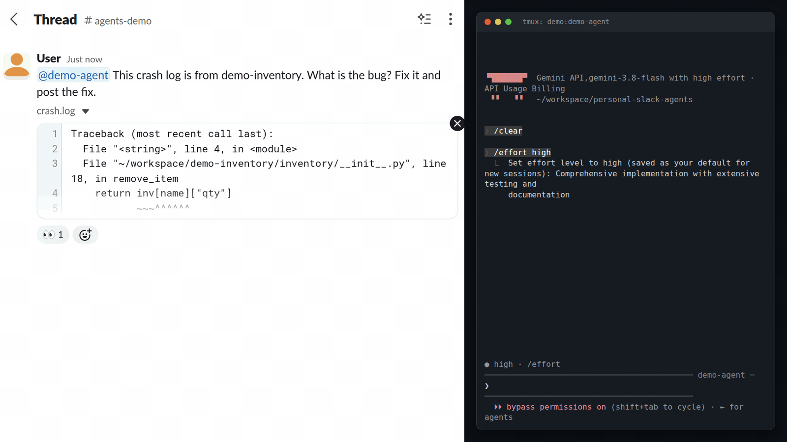</p>
</details>

<details>
<summary><b>Files in, files out</b></summary>
<br>
<p>A file attached in Slack lands in the session as a local path.</p>
<p align="center">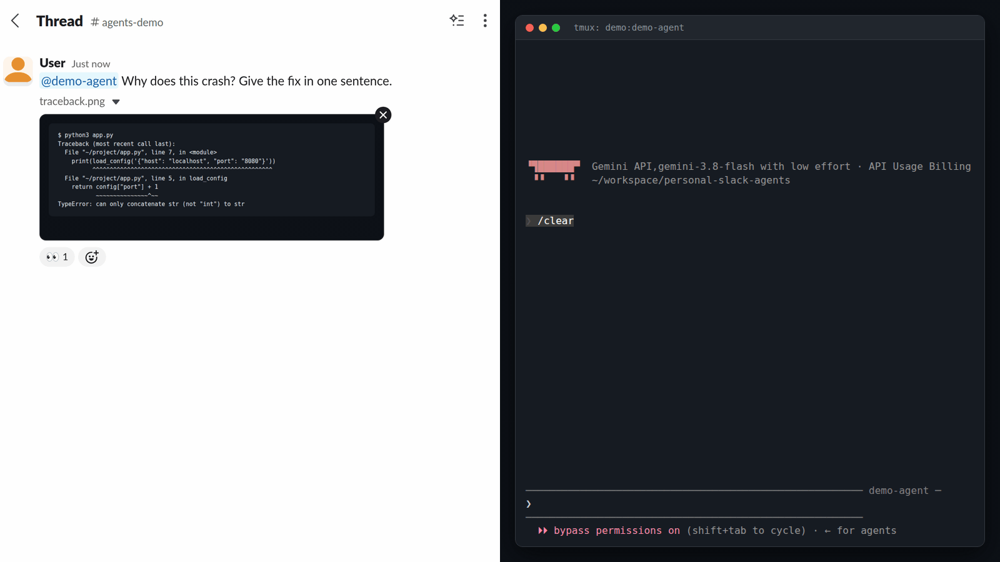</p>
<p>The agent posts a file back with <code>slack-send --file</code>. Here it is a bar chart it just drew.</p>
<p align="center">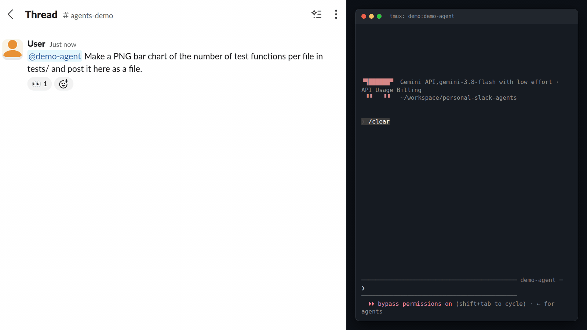</p>
</details>

<details>
<summary><b>Control the live session: <code>!effort</code>, <code>!stop</code>, <code>!goal</code></b></summary>
<br>
<p><code>!effort low</code> changes the effort level. The next question is answered at the new level.</p>
<p align="center">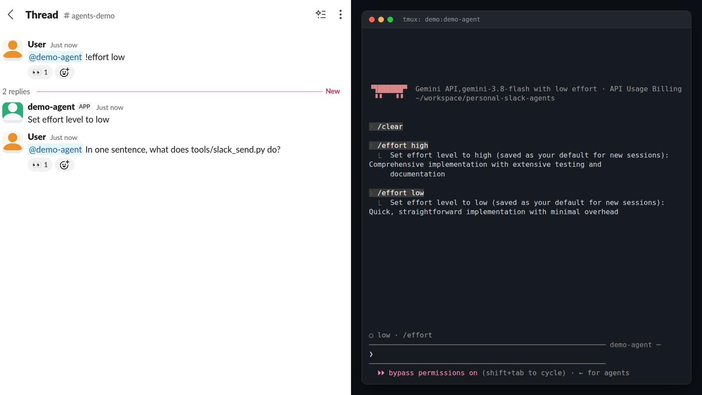</p>
<p><code>!stop</code> interrupts the running task. The pane shows the interrupt.</p>
<p align="center">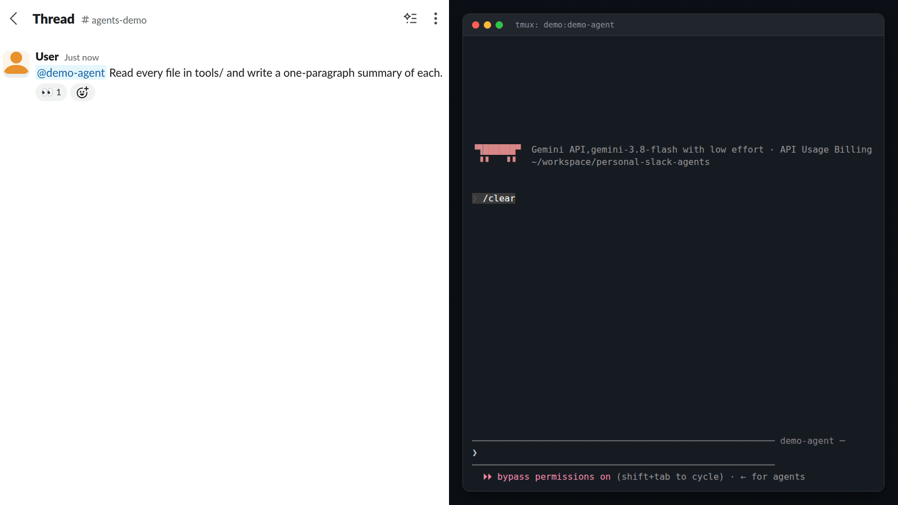</p>
<p><code>!goal</code> gives the session a standing instruction that applies to every later answer.</p>
<p align="center">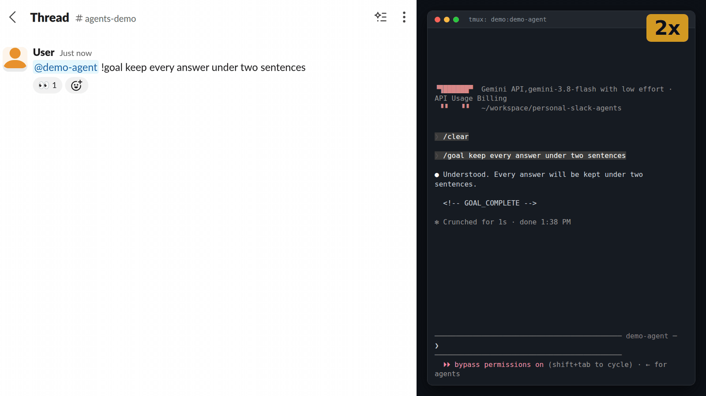</p>
</details>

<details>
<summary><b>Two agents on one repo at once</b></summary>
<br>
<p align="center">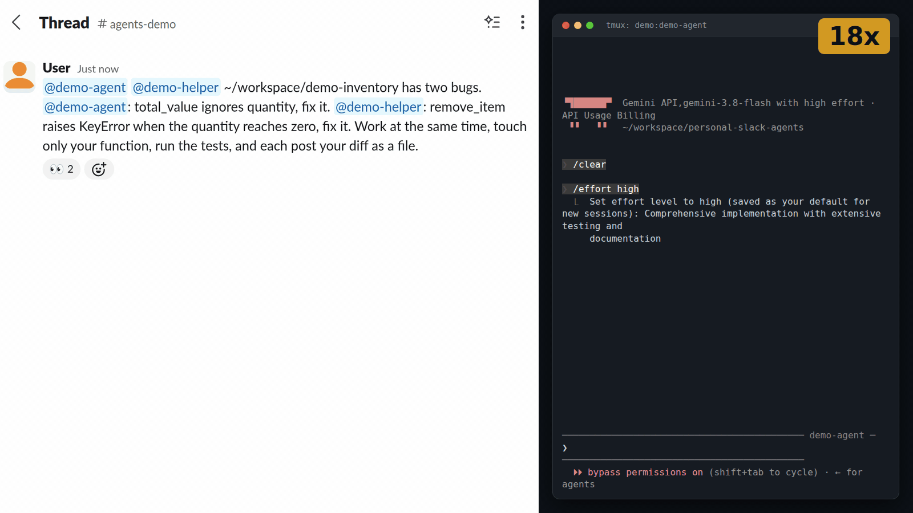</p>
<p align="center"><sub>One message gives <code>demo-agent</code> and <code>demo-helper</code> one bug each. Both work at the same time, and each posts its diff in the thread.</sub></p>
</details>

<details>
<summary><b>Ask an agent on another computer</b></summary>
<br>
<p align="center">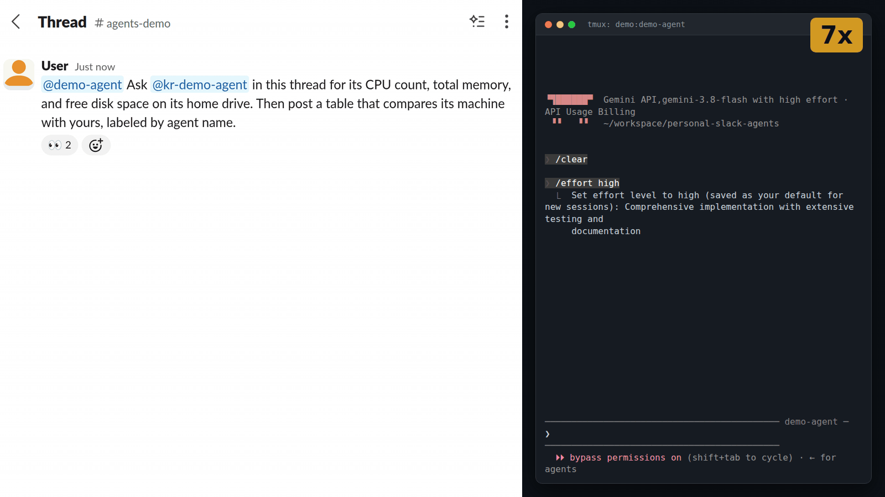</p>
<p align="center"><sub><code>demo-agent</code> on one computer asks <code>kr-demo-agent</code> on another in the same thread, gets its answer, and posts a table comparing both computers.</sub></p>
</details>

<details>
<summary><b>Create a new agent from Slack</b></summary>
<br>
<p align="center">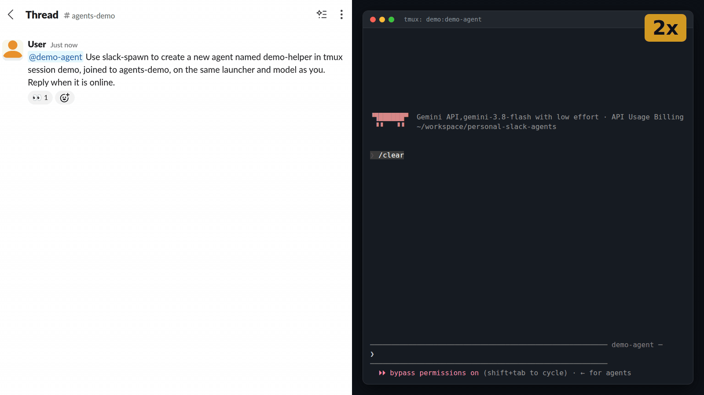</p>
<p align="center"><sub><code>slack-spawn</code> registers <code>demo-helper</code>, starts its session in tmux session <code>demo</code>, and it answers in Slack.</sub></p>
</details>

## What runs on its own

- **Idle sessions compact themselves.** After 10 minutes with no input, a Claude Code session gets one `/compact`, so the next message starts from a small context.
- **Missed messages are delivered after a restart.** The bridge saves the time of the last message it delivered to each agent in `~/.config/slack-bridge/last-seen.json` and delivers anything newer when it starts.
- **Reconnects re-read five minutes.** After the Slack connection drops and comes back, the bridge reads the last 5 minutes again so nothing sent during the gap is lost.
- **New agents load without a restart.** Every 5 seconds the bridge checks `~/.config/slack-bridge/agents/` and connects, reconnects, or drops agents to match.
- **Agents with dead tokens are removed.** When the bridge starts, and whenever it loads a new agent, an agent whose Slack token Slack rejects as inactive, invalid, revoked, or expired is unregistered.
- **Dead sessions are reopened in tmux.** For a Claude Code agent with a recorded session, a message to it after its session exits reopens that session with `--resume` in a new detached tmux window. If the session has not re-registered within 90 seconds, the bot posts 'Agent session is not live; revive failed: <error>' once in the thread.
- **Messages close together arrive together.** A message to a live session waits 10 seconds; messages that arrive during the wait are delivered with it as one turn.
- **Your typing comes first.** A Slack message that arrives while a typed line or paste is unfinished in the terminal waits until you submit or clear it, or 45 seconds after your last keystroke.
- **Forks get one reminder (Antigravity agents only).** If a fork finishes and has posted nothing 120 seconds later, the bridge tells it once to post its answer; a second miss closes the fork and posts 'Reply fork ended twice without posting a reply.' A fork stays open 5 minutes after each turn for follow-ups, and a turn is cut off after 10 minutes. A fork whose turn has not started within 90 seconds gets its prompt sent once more, then fails. Fork status is kept in `~/.config/slack-bridge/forks.json`, which `slack-forks` reads.
- **The bot posts some notices itself.** It posts fork failures, 'Control refused: operator only.' for controls from anyone else, 'Renamed to <name>.' after a rename, 'Unregistered <name>.' after an unregister, and 'Control !<cmd> is not supported for <Runtime> sessions.' for a control the runtime lacks.
- **Slack slowdowns are retried.** When Slack says to slow down, the bridge waits the time Slack names and tries again, up to 5 attempts in all.
- **Logins switch at a usage limit.** If `CLAUDE_ACCOUNT_CYCLE` is set and the session's transcript records a 'You've reached your ... limit' API error, the broker restarts the same conversation with `--resume` under the next login in the list. It tries a limited login again after 1 hour.
- **The login token is refreshed before it expires.** The 6-hour keep-alive refreshes the Slack CLI login only when it has less than 7 hours left.
- **The sweep deletes idle bots.** Where the admin token exists, the hourly sweep deletes every bot app in the workspace, registered by this bridge or not, that has not posted in any channel the admin user is in for 72 hours.
- **Old broker files are cleaned up.** A starting broker removes socket and state files left by brokers that are no longer running.

## Setup details

### Requirements

- Linux with systemd user services, bash, tmux, and python3 (3.11 or newer).
- A Slack workspace where you can create apps.
- The Slack CLI. The setup script installs it when it is missing.
- The agent CLIs you want to expose (`claude`, `codex`, or `agy`) in `~/.local/bin` or on `PATH`.

### What `setup/setup-slack-bridge.sh` does

- Checks that every required tool file exists.
- Installs the Slack CLI when `slack` is not on `PATH`.
- Builds a private virtualenv under `~/.local/share/slack-bridge`.
- Links the tools into `~/.local/bin` (`slack-bridge`, `slack-register`, `slack-spawn`, `slack-send`, `slack-forks`, `slack-sweep`, `slack-admin`, and the brokers).
- Writes the systemd user units: the bridge, a keep-alive timer every 6 hours, and an hourly sweep where the admin token exists.
- Enables linger so the units run without an interactive login, and restarts the bridge.

### Configuration

- `~/.config/slack-bridge/agents/<name>.env` holds each agent's tokens. It is written by `slack-register` and never belongs in this repository.
- `~/.config/slack-bridge/operator.txt` holds the Slack user ids allowed to use controls, one per line.
- `SLACK_DEFAULT_CHANNEL` names the channel every agent joins on registration (default `all-agents`).
- `SLACK_TEAM_ID` names the workspace for `slack-admin`. When it is unset, the only logged-in workspace is used.
- `SLACK_ADMIN_APP_NAME` names the admin Slack app (default `slack-admin`).
- `CLAUDE_PTY_IDLE_COMPACT_SECONDS` sets the idle time before a Claude Code session's automatic `/compact` (default `600`; `0` turns it off).
- `DELIVER_CHANNEL_MESSAGES=true` in an agent's env file delivers channel messages that do not mention it.
- `CLAUDE_ACCOUNT_CYCLE` is a colon-separated list of Claude config directories to switch between when a session hits a usage limit; the session's own `CLAUDE_CONFIG_DIR` must be in the list (default unset, which turns switching off).
- `CLAUDE_ARGS` in an agent's env file holds the flags used when the bridge reopens that session (default: the `--model`/`--effort` of the Claude process that ran `slack-register`, or `--claude-args` when given).
- `slack-sweep --hours` sets how long a bot app must be inactive before the sweep deletes it (default `72`).

<p align="center">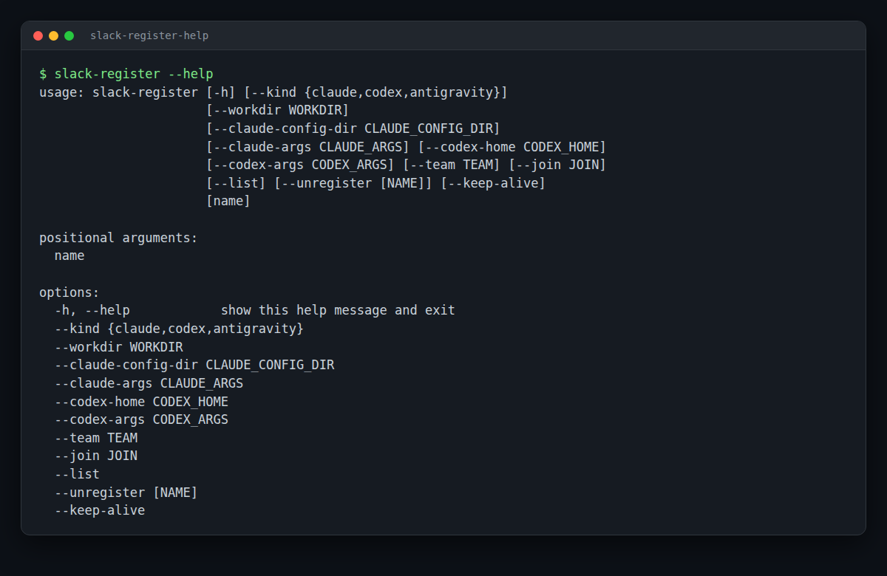</p>

## Create an agent from Slack

```
slack-spawn <name> --tmux-session <session> [--join <channel>] [--launcher "<command>"] [--claude-config-dir <dir>] [--model <model>]
```

- It registers a new agent and starts a Claude Code session for it.
- It opens a window named after the agent in that tmux session, in that session's directory.
- It binds the session to the agent with `claude --session-id` and `--name`.
- A folder that Claude has not trusted yet shows the trust prompt once.
- Every spawned session runs with `--dangerously-skip-permissions`.
- When the bridge restarts a session, it starts it through the same launcher.

`--claude-config-dir` picks the Claude config directory, which is the account. It defaults to `CLAUDE_CONFIG_DIR`.
`--launcher` is the command that starts Claude Code. The default is `claude`.
Any other launcher is a command prefix, such as `ccr cc-work cli --`.
Its first word must be on `PATH` when you run `slack-spawn`.
`slack-spawn` stores that word as an absolute path, together with your `PATH` at that time, and every restart uses both.
The session then runs `<launcher> --session-id <id> --name <name> <flags>` behind `claude-pty-broker`.
`--model` sets the model for the new session.

Start an agent through a claude-code-router profile named `cc-work`:

```
slack-spawn my-agent --tmux-session work --launcher "ccr cc-work cli --" \
  --claude-config-dir ~/.claude-code-router/profiles/cc-work/claude --model "<provider>,<model>"
```

### Several accounts

Each account is its own Claude config directory, such as `~/.claude-work` and `~/.claude-personal`.
Log in to each one once: run `CLAUDE_CONFIG_DIR=~/.claude-work claude`, then `/login`.
A spawned agent picks its account with `--claude-config-dir`.
An account routed through claude-code-router (Codex or Gemini) uses `--launcher "ccr <profile> cli --"` with that profile's `claude` directory.
A shell alias such as `alias claude-work='CLAUDE_CONFIG_DIR=~/.claude-work claude'` only helps you type it by hand. The bridge never needs it.

```
slack-spawn work-agent --tmux-session work --claude-config-dir ~/.claude-work
slack-spawn home-agent --tmux-session work --claude-config-dir ~/.claude-personal
slack-spawn codex-agent --tmux-session work --launcher "ccr cc-codex cli --" \
  --claude-config-dir ~/.claude-code-router/profiles/cc-codex/claude
```

## Two or more computers on one Slack account

Agents on different computers can share one Slack workspace and talk in one thread.
`slack login` gives every login of one Slack user the same token pair.
When one computer rotates that pair, the refresh token on the other computers stops working.
The fix is a service token per computer, which never expires and is separate from the login pair:

1. Run `slack auth token` on the computer.
2. Paste the `/slackauthticket` line it prints into Slack and approve it.
3. Run `slack auth token --challenge <code> --ticket <ticket>`.
4. Save the printed token: `umask 077; printf '%s\n' '<token>' > ~/.config/slack-bridge/service-token-<TEAM_ID>`.

`slack-register` and its keep-alive then use that token and never rotate the login pair.
Reference: https://docs.slack.dev/tools/slack-cli/reference/commands/slack_auth_token/

## Tests

```bash
python3 -m unittest discover -s tests -t .
```
